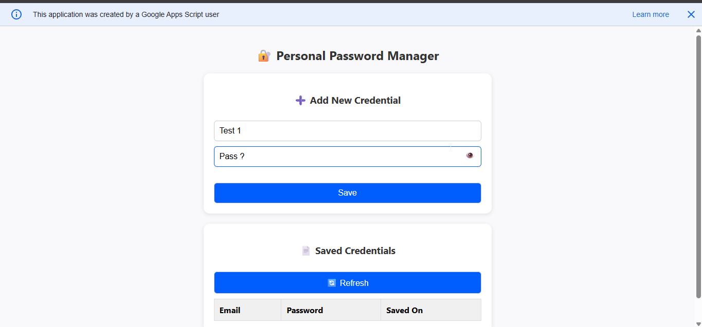
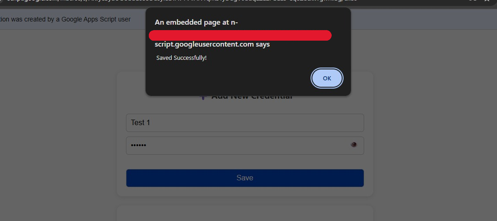
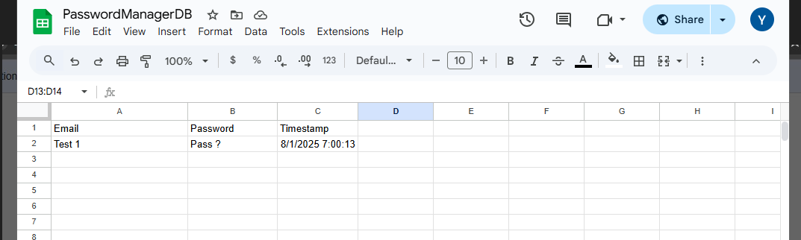

# Password-Manager

# 🔐 Personal Password Manager (Google Apps Script)

A **secure, personal password manager** built with Google Apps Script and Google Sheets.  
Only you can access and store your credentials, protected by a login password.  
No third-party servers — your data is stored safely in your own Google Sheet.

---

## ✨ Features

- 🔐 **Authentication required** to access or view data
- 📥 **Store email + password** entries in a private Google Sheet
- 📄 **View all saved credentials**
- 💻 **Responsive UI** – works on desktop, tablet, and mobile
- 👁️ **Password visibility toggle**
- ✅ Google Sheet backend – easy and free

---

## 💡 How It Works
## 🖼️ Preview

  

  

  

  

